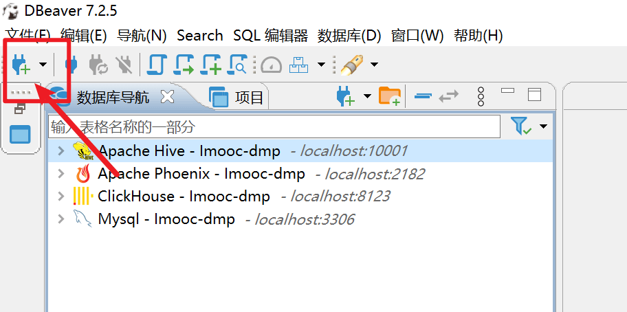
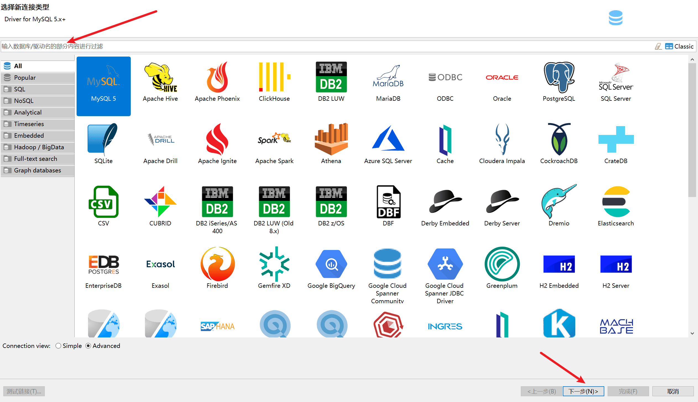
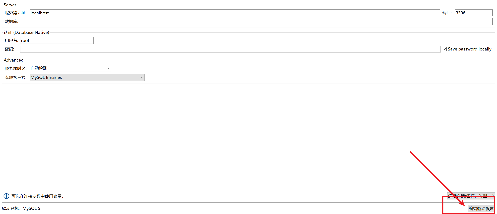
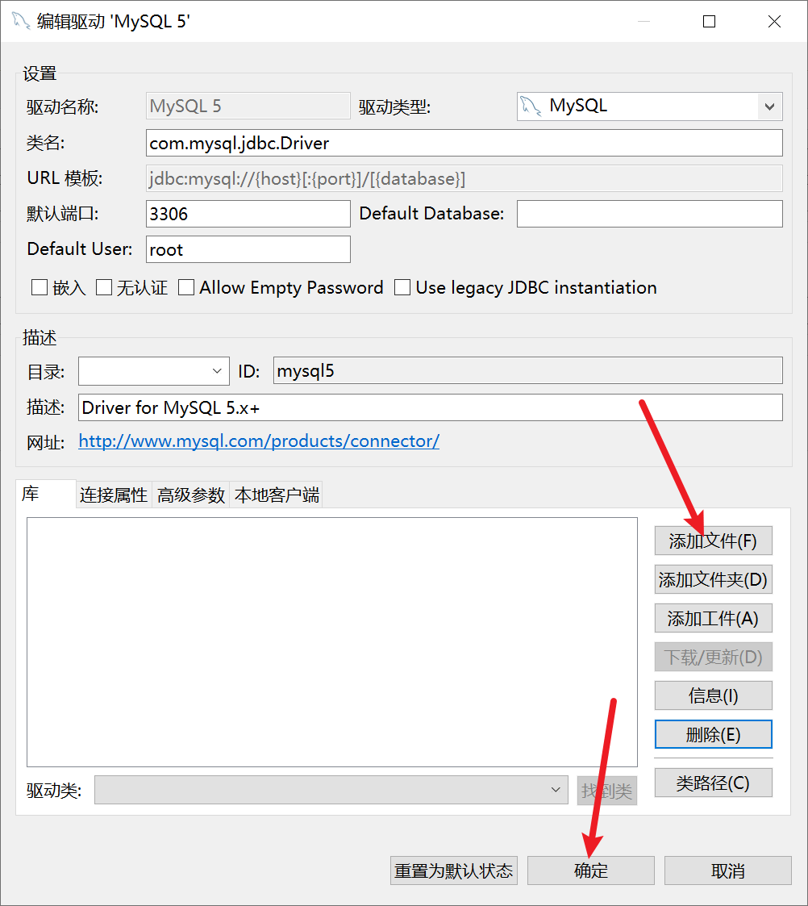
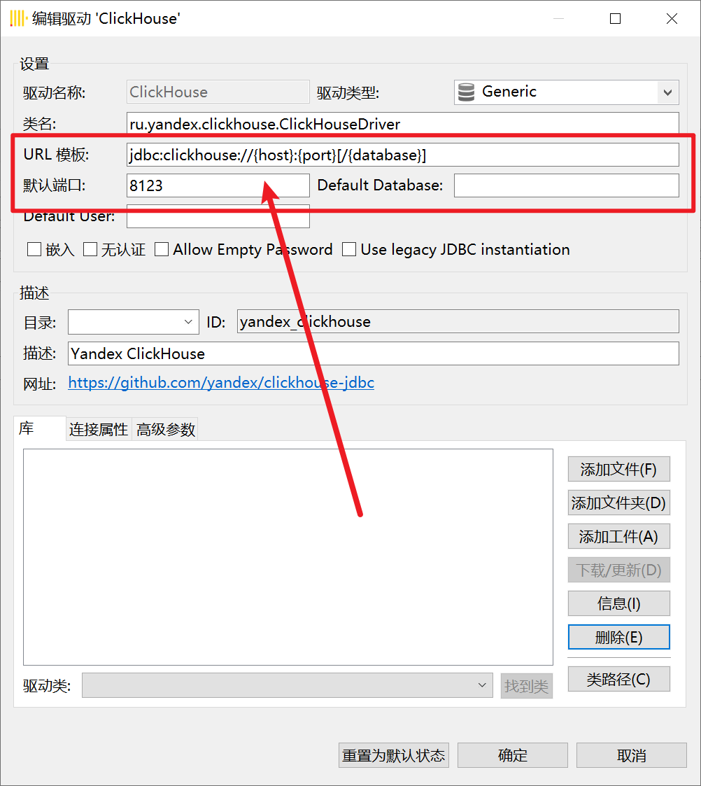
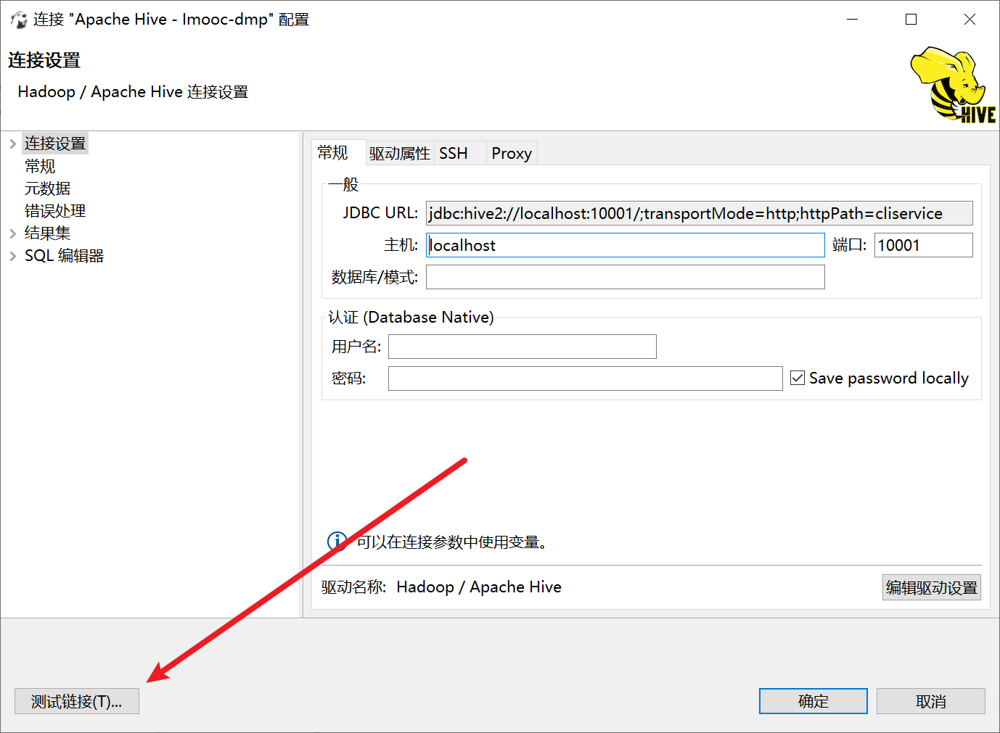

### 步骤8：导入Dbeaver驱动

##### 1. 添加连接

##### 2. 选择连接方式

##### 3. 导入驱动


##### 4. 填写URL模板和默认端口

1. ClickHouse
```
 URL模板：jdbc:clickhouse://{host}:{port}[/{database}]
 默认端口：8123
```

2. Phoenix 
```
URL模板：jdbc:phoenix:{host}[:{port}]:/hbase
默认端口：2182
```

3. Hive
```
URL模板：jdbc:hive2://{host}[:{port}]/[{database}];transportMode=http;httpPath=cliservice
默认端口：10001
```
4. mysql
```
URL模板：无需更改
默认端口：3306
用户名：root
密码：123456
```
##### 5. 连接测试

